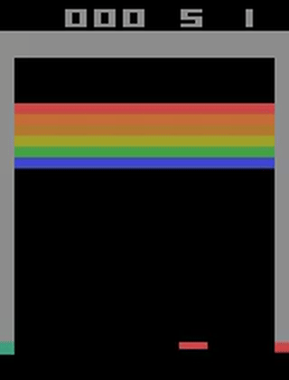

# Deep Q-Learning for Atari

A clean implementation of **vanilla DQN** (Mnih et al., 2015) trained on Atari games via the Arcade Learning Environment. Architecture and training pipeline are inspired by [CleanRL](https://docs.cleanrl.dev/rl-algorithms/dqn/#dqn_ataripy) and [Stable-Baselines3](https://github.com/DLR-RM/stable-baselines3).

---

## Overview

This project implements the original **Nature DQN** with:

- CNN Q-network (3 conv layers + 2 FC layers)
- Experience replay buffer
- Hard target network updates
- ε-greedy exploration with linear decay
- DeepMind-style Atari preprocessing (grayscale, 84×84, 4-frame stack, frame skip 4)
- Periodic evaluation with video recording
- Multi-environment rollouts (`num_envs=2`)

Default environment: **`ALE/Breakout-v5`**

---

## Project Structure

```
.
├── atari.py            # Main training script
├── dqn_eval.py         # Evaluation and checkpoint saving
├── buffer.py           # Replay buffer (SB3-style)
├── atari_wrappers.py   # DeepMind Atari preprocessing wrappers
├── helper.py           # Training curve plotting
├── requirements.txt    # Pinned dependencies
├── setup_env.sh        # macOS venv + dependency installer
└── activate_env.sh     # Activates the virtual environment
```

Generated at runtime (gitignored):

```
runs/                   # Checkpoints and training curves
videos/                 # Evaluation episode recordings
myenv/                  # Python virtual environment
```

---

## Setup

### 1. Create the environment

```bash
bash setup_env.sh
```

This creates a Python 3.12 virtualenv (`myenv/`), installs all dependencies, and downloads Atari ROMs automatically.

### 2. Activate the environment

```bash
source activate_env.sh
# or
source myenv/bin/activate
```

### 3. Install manually (alternative)

```bash
pip install -r requirements.txt
autorom --accept-license
```

---

## Training

```bash
python atari.py
```

To train on a different environment or override hyperparameters:

```bash
python atari.py --env_id ALE/Pong-v5 --total_timesteps 10000000 --learning_rate 1e-4
```

To resume from a checkpoint:

```bash
python atari.py --get_existing_model True --existing_model_path runs/ALE/<run_name>/atari.cleanrl_model
```

All available arguments are defined in the `Args` dataclass in `atari.py` and can be listed with:

```bash
python atari.py --help
```

---

## Evaluation

```bash
python dqn_eval.py
```

`save_and_eval()` saves a checkpoint and runs the eval environment with optional video recording. Videos are saved to `videos/ALE/<run_name>/`.

To plot training curves from a completed run:

```python
from helper import plot_training_curves
plot_training_curves(td_losses, mean_qs, run_name)
```

---

## Architecture

### Q-Network (Nature CNN)

| Layer  | Spec                            |
|--------|---------------------------------|
| Input  | 4 × 84 × 84 (stacked frames / 255) |
| Conv1  | 32 filters, 8×8, stride 4, ReLU |
| Conv2  | 64 filters, 4×4, stride 2, ReLU |
| Conv3  | 64 filters, 3×3, stride 1, ReLU |
| FC1    | 3136 → 512, ReLU               |
| FC2    | 512 → n_actions                |

### TD Target

$$y = r + \gamma \max_{a'} Q_{\text{target}}(s', a')$$

Loss: MSE between $y$ and $Q_\theta(s, a)$.

---

## Hyperparameters

| Parameter               | Default         |
|-------------------------|-----------------|
| `env_id`                | `ALE/Breakout-v5` |
| `total_timesteps`       | 5,000,000       |
| `learning_rate`         | 1e-4            |
| `optimizer`             | Adam            |
| `num_envs`              | 2               |
| `buffer_size`           | 300,000         |
| `batch_size`            | 32              |
| `gamma`                 | 0.99            |
| `tau`                   | 1.0 (hard copy) |
| `target_network_frequency` | 1,000 steps  |
| `learning_starts`       | 5,000 steps     |
| `train_frequency`       | 4 steps         |
| `start_e` / `end_e`     | 1.0 → 0.01      |
| `exploration_fraction`  | 10% of timesteps |
| `eval_frequency`        | 20,000 steps    |
| `eval_episodes`         | 5               |

Device is selected automatically: CUDA → MPS → CPU.

---

## Results

The model included in this repo was trained for **5 million steps** on `ALE/Breakout-v5`. While it has clearly learned to play — breaking bricks and surviving longer episodes — this is far from the full capability of DQN on Breakout. The original Nature paper and most published benchmarks train for **50 million frames** to reach expert-level performance (scores of 400+). At 5M steps the agent is in an intermediate stage: it shows purposeful behavior but still misses many bricks and loses lives unnecessarily.

> To reproduce strong results, set `--total_timesteps 50000000` and use a machine with a GPU.

### Before training (random policy)

The agent takes random actions and scores close to 0.



### After 5M steps

The agent has learned to aim the ball and clear rows, but performance is still sub-optimal.


---

## Dependencies

Key packages (see `requirements.txt` for pinned versions):

| Package       | Version  |
|---------------|----------|
| `torch`       | 2.11.0   |
| `gymnasium`   | 1.3.0    |
| `ale-py`      | 0.11.2   |
| `numpy`       | 2.4.4    |
| `tyro`        | 1.0.13   |
| `tensorboard` | 2.20.0   |
| `wandb`       | 0.27.0   |
| `matplotlib`  | 3.10.9   |
| `opencv-python` | 4.13.0.92 |
| `moviepy`     | 2.2.1    |

---

## References

- Mnih et al., [*Human-level control through deep reinforcement learning*](https://www.nature.com/articles/nature14236), Nature 2015
- [CleanRL — `dqn_atari.py`](https://docs.cleanrl.dev/rl-algorithms/dqn/#dqn_ataripy)
- [Stable-Baselines3](https://github.com/DLR-RM/stable-baselines3)
- [Arcade Learning Environment](https://github.com/Farama-Foundation/Arcade-Learning-Environment)
